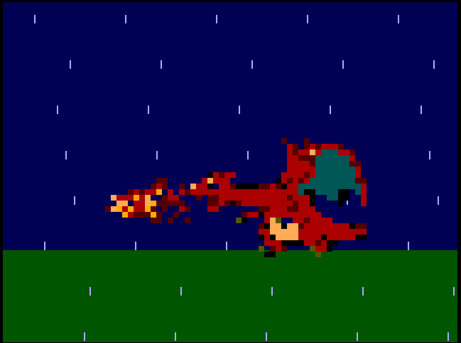

   

# Tiny Tapeout Charizard Flamethrower

A 1x2 tile VGA Charizard Flamethrower.

- [Read the documentation for project](docs/info.md)

## What is Tiny Tapeout?

Tiny Tapeout is an educational project that aims to make it easier and cheaper than ever to get your digital and analog designs manufactured on a real chip.

To learn more and get started, visit https://tinytapeout.com.
